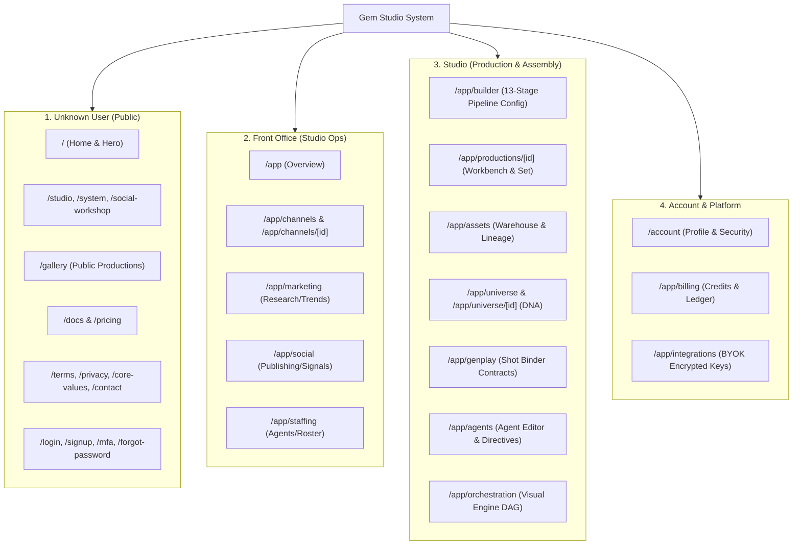

# Gem Studio — Website & UI/UX Design System Specification

**Status:** Living Design Specification  
**Architecture:** Next.js App Router (React 19, Strict TypeScript), Tailwind CSS / Vanilla CSS Variables, OKLCH Color Engine  
**Theme:** Studio Dark (Workbench Macrostructure, Anchor Hue: 350 Pink, Focus: Cyan)  
**Accessibility:** WCAG 2.2 AA Compliant  

---

## 1. Design Philosophy & Macrostructure

Gem Studio is a solo-creator AI film studio SaaS. The user interface reflects an authentic, high-density **Creative Workbench & Control Room** rather than generic enterprise SaaS.

### Core Visual Principles
1. **Density with Legibility:** Maximized information density for film production workflows (timeline, lanes, shot binders, logs) without visual clutter.
2. **True Studio Dark Palette:** Built with OKLCH color space for perceptually uniform lightness, deep neutral blacks, subtle slate surfaces, and targeted chromatic signals.
3. **Intentional Accent Signals:**
   - **Hot Pink (`oklch(0.62 0.28 350)`):** Primary brand anchor, primary action triggers, hero focal points.
   - **Cyan (`oklch(0.85 0.16 205)`):** Active focus outlines, telemetry, system states, interactive hover states.
   - **Lime (`oklch(0.88 0.22 145)`):** Success states, completed jobs, active online workers, verified rights.
   - **Amber (`oklch(0.78 0.16 75)`):** Warning thresholds, approval gates, pending human review, quota notices.
   - **Red (`oklch(0.62 0.22 25)`):** Errors, destructive operations, quota depletion, failed generation steps.
4. **Zero Decorative Noise:** Every border, line, badge, and glow represents an operational state, production status, or interactive boundary.

---

## 2. Design Token System

All tokens are defined in `web/tokens.css` and imported globally in `web/app/globals.css`.

### 2.1 Color Palette (OKLCH Engine)

```css
:root {
  /* Surface Layers */
  --color-bg: oklch(0.12 0.01 270);         /* #0d0e15 - Deep Canvas Base */
  --color-surface: oklch(0.18 0.015 260);    /* #1a1b24 - Card & Container Surface */
  --color-surface-2: oklch(0.22 0.015 255);  /* #232530 - Elevated Panels & Rail */
  --color-surface-3: oklch(0.27 0.015 250);  /* #2f3240 - Interactive Items / Hover */

  /* Text Contrast Hierarchy */
  --color-text: oklch(0.93 0.005 260);      /* #e8e9ed - Primary High-Contrast Text */
  --color-text-muted: oklch(0.68 0.01 260);  /* #9ca0b0 - Body & Label Text */
  --color-text-faint: oklch(0.58 0.01 260);  /* #777b8c - Placeholder & Metadata */

  /* Structural Borders & Hairlines */
  --color-border: oklch(0.38 0.01 260);      /* #4e5264 - Standard Element Separation */
  --color-border-2: oklch(0.36 0.015 255);   /* #474c5d - Subtle Inner Border */
  --color-hairline: oklch(1 0 0 / 0.05);     /* Ghost dividers and grid lines */

  /* Brand & Status Accents */
  --color-pink: oklch(0.62 0.28 350);        /* Primary Brand Accent */
  --color-pink-hover: oklch(0.66 0.26 350);  /* Button & Link Hover */
  --color-pink-active: oklch(0.55 0.28 350); /* Button Active Press */
  --color-cyan: oklch(0.85 0.16 205);        /* Focus & Secondary Highlights */
  --color-lime: oklch(0.88 0.22 145);        /* Success / Completed */
  --color-amber: oklch(0.78 0.16 75);        /* Attention / Approval Gates */
  --color-red: oklch(0.62 0.22 25);          /* Danger / Error / Reject */
  --color-white: oklch(0.98 0 0);            /* Crisp White Callouts */
}
```

### 2.2 Typography System

The typography uses three complementary font families loaded via Next.js Google Font optimization:

| Token | Font Family | Usage |
|---|---|---|
| `--font-display` | `'Syne', 'Space Grotesk', sans-serif` | Editorial headlines, landing hero, module banners, major section titles |
| `--font-body` | `'Space Grotesk', system-ui, sans-serif` | Core interface text, form controls, card titles, navigation items |
| `--font-mono` | `'DM Mono', ui-monospace, monospace` | Data tables, timecodes, JSON contracts, shot IDs, token counts, log streams |

#### Type Scale
- `--text-xs`: `0.6875rem` (11px) — Timestamps, badges, metadata, system pill tags
- `--text-sm`: `0.8125rem` (13px) — Secondary descriptions, table body, input hints
- `--text-md`: `1.0000rem` (16px) — Standard UI copy, form input text, default labels
- `--text-lg`: `1.2500rem` (20px) — Panel headers, subsection titles, modal headers
- Display 1: `2.2500rem` – `3.5000rem` — Marketing Hero, Main Dashboard title

### 2.3 Spatial Scale & Radii

A strict 4px / 8px linear spatial scale guarantees structural alignment across complex IDE grids:

```css
--space-1: 0.25rem;  /* 4px */
--space-2: 0.50rem;  /* 8px */
--space-3: 0.75rem;  /* 12px */
--space-4: 1.00rem;  /* 16px */
--space-6: 1.50rem;  /* 24px */
--space-8: 2.00rem;  /* 32px */
--space-12: 3.00rem; /* 48px */
--space-16: 4.00rem; /* 64px */

--radius-sm: 0.50rem;  /* 8px - Buttons, Inputs, Badges */
--radius-md: 1.00rem;  /* 16px - Cards, Panels, Modals */
--radius-pill: 999px;  /* Pill Badges, Status Dots */
```

### 2.4 Shadows & Atmospheric Depth

```css
--shadow-pink: 0 0 2rem oklch(0.62 0.28 350 / 0.22);
--shadow-cyan: 0 0 2rem oklch(0.85 0.16 205 / 0.20);
--shadow-lime: 0 0 2rem oklch(0.88 0.22 145 / 0.16);
--shadow-panel: 0 1.5rem 4rem oklch(0 0 0 / 0.34);
```

---

## 3. Information Architecture & Four-Module Map

Gem Studio strictly enforces a four-module sitemap.



### Module 1: Unknown User (Public Discovery & Auth)
- **Public Hero & Signal Board:** High-impact Syne typography with dark canvas, dynamic audio/video signal filters, and direct CTA to studio signup.
- **Explainers (`/studio`, `/system`, `/social-workshop`):** Deep-dive visual walkthroughs of the 13-stage automated film pipeline.
- **Public Proof Gallery (`/gallery`):** Curated public master records showing generated AI films, shot lineage, and prompt/model attributions.
- **Pricing & Credit Model (`/pricing`):** Clear distinction between Solo Creator tier and Studio tier allowances, with BYOK transparency.
- **Authentication Routes (`/login`, `/signup`, `/mfa`, `/verify-email`):** Centered card layout with single-focus inputs, WebAuthn/TOTP challenge support, and zero clutter.

### Module 2: Front Office (Operations & Strategy)
- **Studio Mission Control (`/app`):** Active productions carousel, real-time credit burn rate, agent availability matrix, and quick-launch actions.
- **Channels Desk (`/app/channels`):** Brand voice bibles, target demographics, production frequency rules, and visual style guides.
- **Market & Research Desk (`/app/marketing`):** Trend analysis, viral hook databases, audience response telemetry.
- **Social Distribution (`/app/social`):** Platform-specific aspect ratio packages (16:9, 9:16, 1:1), scheduling ledger, and engagement feedback loops.
- **Staffing Desk (`/app/staffing`):** Assignment of specialized AI agents to channel departments.

### Module 3: Studio (Core Creative Engine)
- **13-Stage Production Pipeline (`/app/builder`):** Visual lane configurator for the 13 film departments:
  1. *Ideation* → 2. *Scripting* → 3. *Storyboarding* → 4. *Worldbuilding/Universe* → 5. *Character Casting (cDNA)* → 6. *Location Scouting (lDNA)* → 7. *Prop/Object Design (pDNA)* → 8. *Audio/Voice Design* → 9. *Shot Generation* → 10. *VFX & Upscaling* → 11. *FFmpeg Master Assembly* → 12. *Quality & Rights Review* → 13. *Release Packaging*.
- **Production Set & Assembly Workbench (`/app/productions/[id]`):** Dual-pane workspace with shot list binder on left, live video/timeline preview in center, and inspector/prompt parameters on right.
- **Universe & DNA Continuity (`/app/universe`):** Living continuity bible tracking Characters (cDNA), Locations (lDNA), and Props (pDNA) to prevent visual drift across shots.
- **Asset Warehouse (`/app/assets`):** Version-controlled media vault with automated SHA-256 lineage tracking, model provenance, and license attestations.
- **Workflow Orchestration Engine (`/app/orchestration`):** Visual DAG editor for custom handoff rules (Manual review gates, Semi-Auto approval thresholds, Fully Automated continuous generation).

### Module 4: Account & Infrastructure
- **Security & Identity (`/account`):** Passkey management, TOTP 2FA configuration, session revocation, single-click workspace data export, and account deletion.
- **Credit Accounting (`/app/billing`):** Real-time ledger of generation credits, token breakdown per provider, and transaction receipts.
- **BYOK Key Management (`/app/integrations`):** AES-256-GCM encrypted key storage for OpenAI, Anthropic, Midjourney/FLUX, ElevenLabs, Runway, and custom inference endpoints.

---

## 4. Shell & Layout Architecture

### 4.1 Master Shell Layout
```
+------------------------------------------------------------------------------------+
|  [Logo] Gem Studio   | Search (Cmd+K) | [Active Channel] | Credits: 4,850 | [Avatar] | (Header)
+------------------------------------------------------------------------------------+
| [Nav Rail]  |                                                        | [Inspector] |
| - Overview  |  MAIN PRODUCTION CANVAS & WORKBENCH                    | - Shot Meta |
| - Channels  |  - Active Shot List (GenPlay Binder)                   | - Seed/Prompt
| - Pipeline  |  - Interactive Video Player / Assembly Preview         | - Agent Spec|
| - Universe  |  - 13-Stage Pipeline Progress Bar                      | - Approvals |
| - Assets    |  - Live Worker Log Stream (SSE / WebSocket)            |             |
| - Settings  |                                                        |             |
+------------------------------------------------------------------------------------+
| Status: Worker Idle | Active Branch: dev | Storage: 4.2GB / 50GB | Latency: 42ms   | (Footer Bar)
+------------------------------------------------------------------------------------+
```

### 4.2 Responsive Breakpoints
- **Mobile (< 640px):** Single-column stacked view. Navigation collapses into a full-height drawer (`mobile-menu.tsx`). Heavy workbench views switch to card-based tabbed steps.
- **Tablet (640px – 1024px):** Compact icon-only navigation rail. Two-column layout (Sidebar + Canvas).
- **Desktop (1024px – 1440px):** Full 3-pane workbench (Nav Rail + Canvas/Timeline + Collapsible Inspector).
- **Ultrawide (> 1440px):** Full-width expanded IDE layout with dual live monitors (GenPlay shot viewer + Master Assembly preview).

---

## 5. UI Component Hierarchy & Patterns

### 5.1 Common Atoms & Primitives
- **Button System:**
  - `.button-primary`: Vibrant Pink background (`--color-pink`), dark text, subtle pink glow on hover.
  - `.button-secondary`: Subtle surface background (`--color-surface-2`), hairline border (`--color-border`), white text.
  - `.button-ghost`: Transparent background, hover highlight, used for toolbar controls.
  - `.button-danger`: Soft red border and text, red background on active press.
- **Form Controls:**
  - Standard dark input field with `--color-surface` fill, `--color-border` outline, and bright Cyan focus ring (`--color-focus`).
  - Monospace code & prompt editors with syntax highlight and character counter.
- **Status & Telemetry Badges:**
  - Pill shape (`--radius-pill`), 11px uppercase monospace font, soft background mix with saturated status dot.

### 5.2 Composite Product Components
- **`HeroStage` (`marketing/hero-stage.tsx`):** Ambient interactive backdrop with canvas-driven particle lines, glowing radial light pulses, and dynamic action buttons.
- **`SignalBoard` (`marketing/signal-board.tsx`):** Filterable telemetry grid displaying real-time generation signals, channel frequencies, and public proofs.
- **`ProductionProgress` (`product/production-progress.tsx`):** Horizontal stepped pipeline tracker displaying current execution phase, gate status (Pending / Approved), and progress percentage.
- **`ExecutionLive` (`product/execution-live.tsx`):** Terminal-style log drawer with ANSI color parsing, real-time step duration timer, and worker retry controls.
- **`CommandMenu` (`shell/command-menu.tsx`):** Global Spotlight-style search modal (triggered via `Cmd+K` / `Ctrl+K`) for rapid navigation across productions, characters, assets, and documentation.

---

## 6. Motion & Micro-interactions

Motion in Gem Studio is restrained, physics-based, and performance-optimized using CSS transforms and hardware-accelerated transitions.

```css
/* Motion Curves */
--ease-out: cubic-bezier(0.22, 1, 0.36, 1);
--dur-fast: 160ms;  /* Tooltips, Button press, Toggle switches */
--dur-base: 280ms;  /* Dropdowns, Modal reveals, Panel expansion */
--dur-slow: 700ms;  /* Progress bar fills, Ambient background shifts */
```

### Accessibility Fallback (Reduced Motion)
All animations are strictly wrapped with `@media (prefers-reduced-motion: reduce)`:
```css
@media (prefers-reduced-motion: reduce) {
  *, *::before, *::after {
    animation-duration: 0.01ms !important;
    animation-iteration-count: 1 !important;
    transition-duration: 0.01ms !important;
    scroll-behavior: auto !important;
  }
}
```

---

## 7. Accessibility (A11y) & Engineering Compliance

1. **Color Contrast Standards:**
   - Body copy (`--color-text` on `--color-bg`): Contrast ratio > `12.5:1` (Exceeds WCAG AAA).
   - Muted labels (`--color-text-muted` on `--color-surface`): Contrast ratio > `4.8:1` (Exceeds WCAG AA).
2. **Keyboard Navigation:**
   - All interactive controls feature visible `2px solid var(--color-focus)` outlines via `:focus-visible`.
   - Modals and drawers implement strict focus trapping and `Escape` key listeners.
   - Global skip link (`#main-content`) provided on all pages.
3. **Screen Reader Support:**
   - Semantic HTML elements (`<header>`, `<nav>`, `<main>`, `<aside>`, `<footer>`, `<section>`).
   - Dynamic states (live job execution, upload progress) announced via `aria-live="polite"`.
   - Explicit `aria-expanded` and `aria-controls` bindings on collapsible navigation and accordion drawers.

---

## 8. File Structure Reference

```
web/
├── app/
│   ├── (auth)/          # Authentication flow routes
│   ├── (marketing)/     # Public discovery and explainer routes
│   ├── (product)/       # Protected Studio and Front Office workspace routes
│   ├── layout.tsx       # Global root layout with fonts and metadata
│   ├── globals.css      # CSS token implementations & base utilities
│   └── tokens.css       # Canonical design token declarations
├── components/
│   ├── auth/            # Auth forms, MFA settings, signout actions
│   ├── marketing/       # Hero stage, signal board, marketing effects
│   ├── product/         # Workbench panels, execution monitors, agent editor
│   └── shell/           # Command menu, headers, footers, nav rails
```
